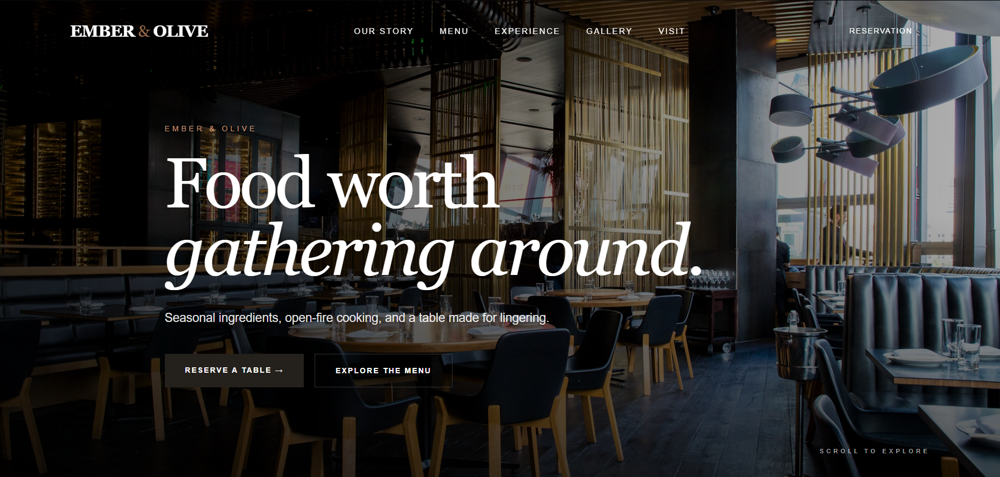

# 🍽️ Ember & Olive

A modern, responsive restaurant website designed for a premium dining experience.

## 🌐 Live Demo

[View Ember & Olive Website](https://aryajha003.github.io/Ember-Olive/)

## ✨ Features

- Responsive design for desktop and mobile
- Modern restaurant landing page
- Interactive navigation menu
- Restaurant menu section
- Gallery section
- Reservation form
- Smooth scrolling navigation
- Mobile-friendly hamburger menu

## 🛠️ Technologies Used

- HTML5
- CSS3
- JavaScript

## 📱 Responsive Design

The website is designed to provide a consistent experience across:

- Desktop
- Tablet
- Mobile

## 🤖 Development

This project was created as a portfolio project using AI-assisted development and modern web technologies.

## 📸 Preview

### Desktop

## 📌 Project Purpose

This project demonstrates my ability to plan, design, customize, and deploy a modern responsive website using AI-assisted development tools and web technologies.
